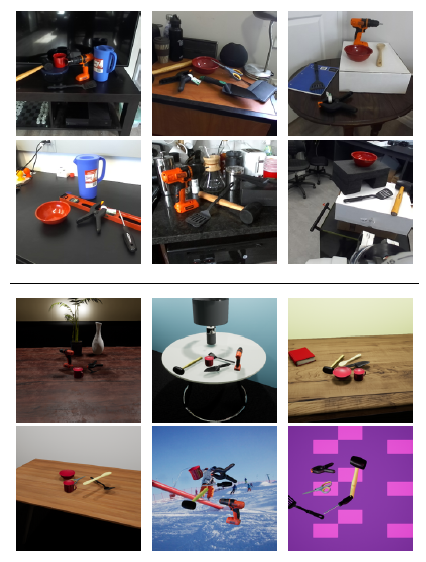

### arl-affpose-dataset-utils

This repo contains tools used to prep the Advanced Robotics Lab (ARL) Affordance Pose (AffPose) Dataset. 

[Real](https://drive.google.com/drive/folders/1gP-vQVuDKdhCxdViRxAeoH8v99sTfPXi?usp=sharing) and [Synthetic](https://drive.google.com/drive/folders/1X47BIXqyMO9xyoFMCXEGVPP9T0ZDEPUe?usp=sharing) images can be found here. [Object Mesh files](https://drive.google.com/drive/folders/1X47BIXqyMO9xyoFMCXEGVPP9T0ZDEPUe?usp=sharing) can also be downloaded by clicking the link.

The dataset was created using [LabelFusion](https://github.com/RobotLocomotion/LabelFusion) for Real Images or [NDDS](https://github.com/NVIDIA/Dataset_Synthesizer) for Synthetic Images. Note that a Stereolab ZED camera at a resolution of 1280x720 was used or capture or simulate images. 

I used the arl-affpose-dataset with the following repos.

1. [LabelFusion](https://github.com/RobotLocomotion/LabelFusion) for generating real images.
2. [NDDS](https://github.com/NVIDIA/Dataset_Synthesizer) for generating synthetic images.
4. [pytorch-simple-affnet](https://github.com/UW-Advanced-Robotics-Lab/pytorch-simple-affnet) for predicting an object affordance labels.
5. [densefusion](https://github.com/UW-Advanced-Robotics-Lab) for predicting an object 6-DoF pose.
5. [arl-affpose-ros-node](https://github.com/UW-Advanced-Robotics-Lab/arl-affpose-ros-node): for deploying our network for 6-DoF pose estimation with our ZED camera.
6. [barrett-wam-arm](https://github.com/UW-Advanced-Robotics-Lab/barrett-wam-arm) for robotic grasping experiments. Specifically barrett_tf_publisher and barrett_trac_ik. 

Here are several examples! 

  

